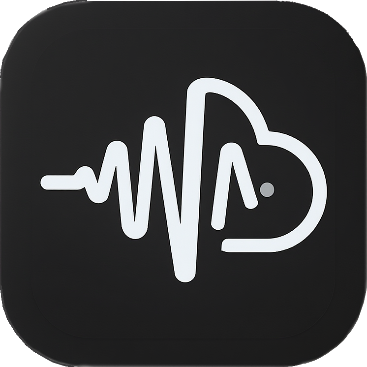
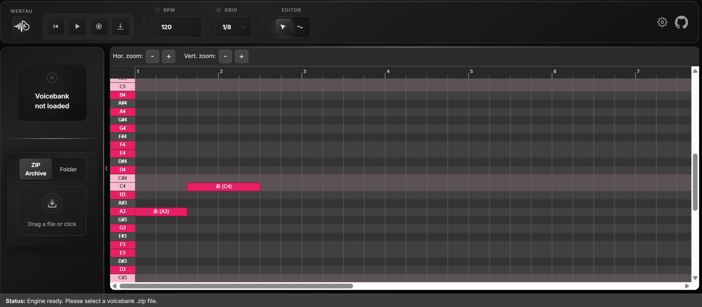

  

    
    <h1 style="margin: 0; position: relative; top: 3px;; border-bottom: none;">WebTAU</h1>
  

  

    WebTAU is a simple browser-based vocal synth that supports UTAU voicebanks. It is currently in an early stage of development and intended for experimental use only.
    
  

  

    
    
  

---

### ✨ Features

*   **Browser-Based:** No installation required. Runs on modern web browsers.
*   **Voicebank Loading:** Load simple UTAU-style voicebanks.
*   **Basic Sequencing:** Input notes and lyrics on a simple timeline.
*   **WAV Export:** (Planned) Save your synthesized audio as a `.wav` file.

## 🗺️ Roadmap

*   [ ] Support for basic UST file import.
*   [ ] Pitch bend improvements.
*   [ ] MIDI file import.
*   [ ] Caching.

## Feedback

If you have any questions, suggestions, or encounter any issues, please feel free to [open an issue](https://github.com/charl1e7/webtau/issues/new).

## Credits

*   **Straycat Engine:** This project is based on the foundational work of the [Straycat engine](https://github.com/UtaUtaUtau/straycat-rs).

*   **Rust-WORLD Library:** This project uses the [Rust-WORLD library](https://github.com/BiggieBoo18/Rust-WORLD).

*   **WORLD:** This project uses the [WORLD](https://github.com/mmorise/World) lib for speech analysis.

## 📄 License

Distributed under the MIT License. See `LICENSE` for more information.

